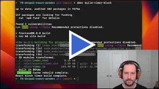
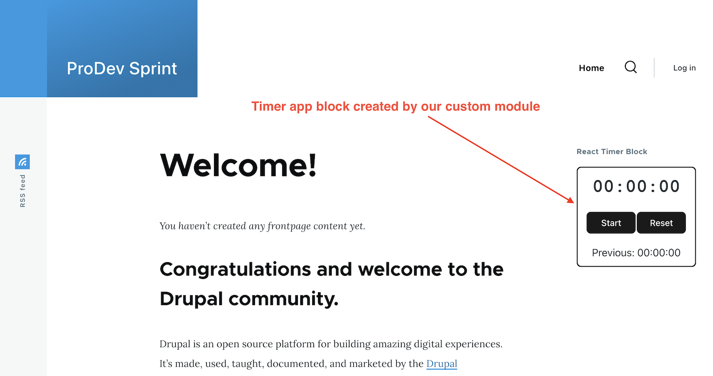

# Create a Custom React Block or Route

[back to main project README](../../README.md)

## Summary

The goal for this exercise is to create a custom block route in Drupal that loads a React app. Alternatively, a custom controller route can be used to load the React app instead of a block. All of the code for the block or controller should be placed in a custom Drupal module.

## Acceptance Criteria

- A new Drupal module has been created 
- The new module contains a custom block plugin or controller
- A React app been added to the module
- The react app is added to the custom block or route and is displayed on a page

## Helpful Resources

- Tutorial: [Connect React to a Drupal Theme or Module](https://drupalize.me/tutorial/connect-react-drupal-theme-or-module?p=3253)
- Blog Post: [Recipe for Embedded React Component](https://www.mediacurrent.com/)
- Documentation: [Creating Custom Blocks in Drupal](https://www.drupal.org/docs/creating-modules/creating-custom-blocks)
- Documentation: [Adding assets (CSS, JS) to a Drupal module via *.libraries.yml](https://www.drupal.org/docs/develop/creating-modules/adding-assets-css-js-to-a-drupal-module-via-librariesyml)

## Setup Instructions

Skip to step 3 if Docker and DDEV are already installed.

1. [Install Docker or Colima](https://ddev.readthedocs.io/en/stable/users/install/docker-installation/)
2. [Install DDEV](https://ddev.readthedocs.io/en/stable/users/install/ddev-installation/)
3. Clone this repo to your local machine
4. `cd` to the root of the project
5. Run the setup commands below in you terminal
```bash
ddev start
ddev composer install
ddev site-install p1
```
Run the launch command to open the site unauthenticated
```bash
ddev launch
```
Or run the drush user login command to generate a one-time login
```bash
ddev drush uli
```

## Solution Media

Solution Overview Walkthrough Video

[](https://www.youtube.com/watch?v=n2vvoBUpZyg)

## Implementation Details

This solution adds a React timer widget as a drupal block. 


The block should display in the sidebar of each page. The code for this solution is all contained in a custom module located at:
```
/web/modules/custom/ca_custom_block_react_timer
```
The frontend react app code is located at:
```
/web/modules/custom/ca_custom_block_react_timer/src/frontend
```
The compiled frontend that gets sent to the browser is located at:
```
/web/modules/custom/ca_custom_block_react_timer/dist
```
## Project shortcuts
There are a few custom DDEV commands provided for convenience

Install Drupal, enable the ca_custom_block_react_timer module, add the custom block to the sidebar region, and clear drupal cache.
```bash
ddev site-install p1
```
Build the module frontend and export compiled React app to the `dist` folder
```bash
ddev build-timer-block
```
Run all Frontend tests for the React Timer app
```bash
ddev test-timer-block
```


